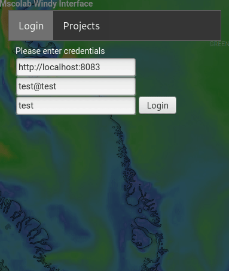

This plugin enables users to use MSColab flight planning features within windy.

# Install
1. Navigate to the menu at the top left of Windy
2. Select "Install Windy plugin"
3. Select "Load plugin directly from npm"
4. Enter "windy-plugin-mscolab"
5. Click on load

# Use
1. Log into an MSColab server with your credentials
2. Select a project

- Add waypoints by clicking on the map
- Move waypoints by dragging them
- Remove waypoints by clicking on them and selecting "Remove"

